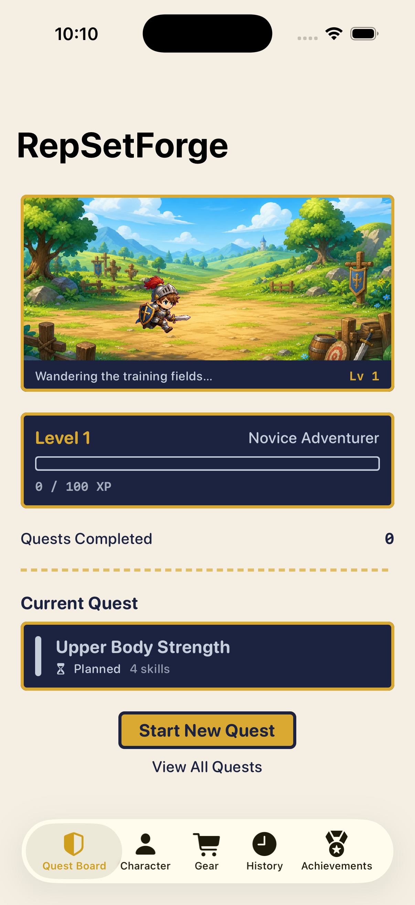
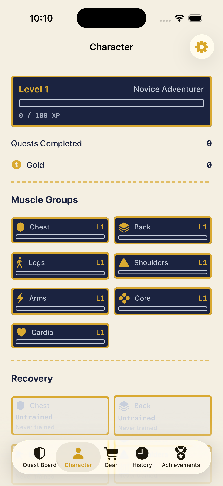
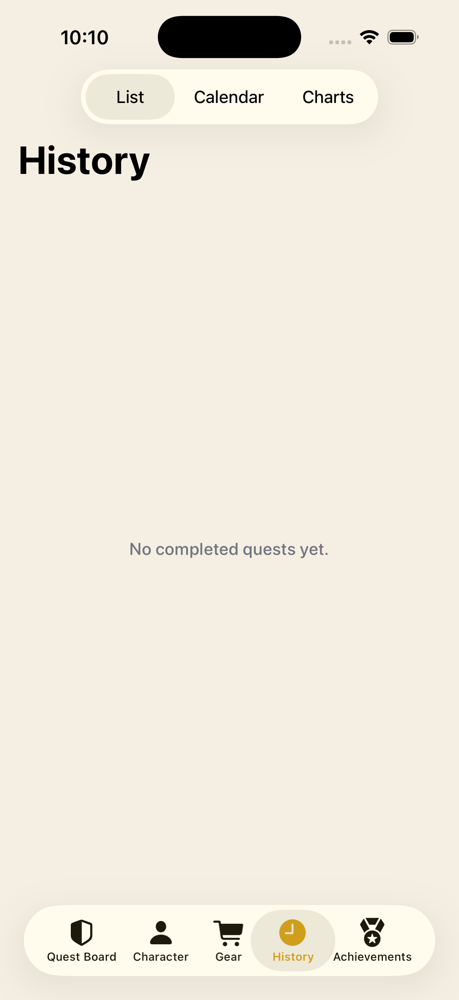
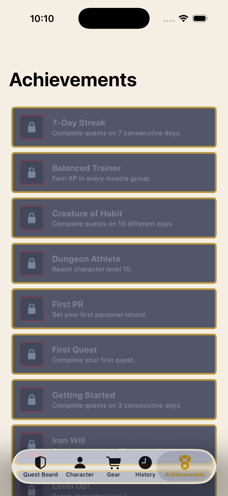

# Visual QA Checklist

Reference screenshots and a manual review checklist for RepSetForge's core screens, captured on iPhone 17 (iOS 26 simulator) with `--preview-data`. Re-capture and replace these images whenever a change touches shared theme/components (`RepSetForgeTheme.swift`, `Pixel*` components) so regressions are easy to spot by diffing images.

Re-capture command pattern (swap `--tab N`, see indices below):

```bash
xcrun simctl terminate <device> dev.gnwn.RepSetForge
xcrun simctl launch <device> dev.gnwn.RepSetForge --preview-data --tab 0
xcrun simctl io <device> screenshot Docs/qa-screenshots/dashboard.png
```

Tab indices: `0` Quest Board (Dashboard), `1` Character, `2` Gear, `3` History, `4` Achievements.

## Dashboard (Quest Board)



- [ ] RPG scene renders (background + hero sprite), status bar shows correct level
- [ ] Level/XP stat panel shows correct values, XP bar fill matches progress
- [ ] "Quests Completed" count matches actual completed-quest count
- [ ] Current Quest card shows if any quest is active/planned; otherwise the empty state ("No active quest") shows
- [ ] Suggested Quest card appears only when a repeated routine is overdue and no quest is active
- [ ] "Start New Quest" and "View All Quests" both present and tappable

## Character



- [ ] Level/title/XP bar match the Dashboard's values
- [ ] Gold row shows the correct total
- [ ] Training Style badge appears once any muscle has XP (hidden for a fresh character — confirmed correct in this screenshot, a Level 1/0 XP character)
- [ ] Muscle Groups grid shows all 7 groups with correct level/XP bar per group
- [ ] Recovery section colors match status (gray=untrained, red=fatigued, orange=recovering, green=fresh) and "N days ago" text is accurate
- [ ] Insights section (push/pull balance, neglected muscle) appears only once there's real training data
- [ ] Personal Records list appears only once at least one PR exists
- [ ] Settings gear (top-right) opens the weight-unit sheet

## Quest Detail — **requires manual QA in Xcode/Simulator** (tap-only, no automation in this environment)

Reachable via Dashboard → Current Quest card, or Quest List → any quest.

- [ ] Quest name/date editable when not completed; read-only (`LabeledContent`) once completed
- [ ] Journal section (notes + perceived-effort picker) editable in both states
- [ ] Skills list shows each exercise with primary muscle; swipe-to-delete works pre-completion
- [ ] Add Skill sheet: name field, autocomplete chips appear while typing, each chip's chart-icon button opens that exercise's metrics
- [ ] Exercise Logging screen: set rows, checkbox bounce animation on completion, rest-timer banner appears/counts down without disabling other controls, "History" toolbar button opens `ExerciseMetricsView`
- [ ] "Complete Quest" button present pre-completion; "Undo Completion" toolbar action present post-completion

## Completion — **requires manual QA in Xcode/Simulator** (only reachable by actually completing a quest — not a revisitable screen, no deep link)

Reachable via Quest Detail → "Complete Quest".

- [ ] Header checkmark-seal pops in with a spring; "Quest Complete!" + quest name shown
- [ ] Level Up section appears only when a level-up occurred, staggers in per entry
- [ ] XP reward rows (character, each trained muscle, gold) stagger in, "LEVEL UP!" tags show a squared (not capsule) badge
- [ ] Achievements Unlocked / New Personal Records! / Equipment Found! sections appear only when non-empty, each staggers in
- [ ] "Done" dismisses back to Quest Detail (now read-only)

## History



- [ ] List/Calendar/Charts segmented control switches correctly; List is the default
- [ ] List: completed quests sorted newest-first, XP shown, swipe-to-duplicate works
- [ ] Calendar: month grid, gold dot on days with a completed quest, gold outline on today, tapping a day lists that day's quests
- [ ] Charts: Week/Month toggle, three bar charts (XP, Volume, Days Trained) render without clipping
- [ ] Empty state ("No completed quests yet.") shown correctly when there's no history (confirmed in this screenshot)

## Achievements



- [ ] Locked achievements show a lock icon, muted/desaturated badge, red-tinted border
- [ ] Unlocked achievements show their real icon, gold badge, and unlock date
- [ ] List is legible and un-clipped at the default Dynamic Type size
